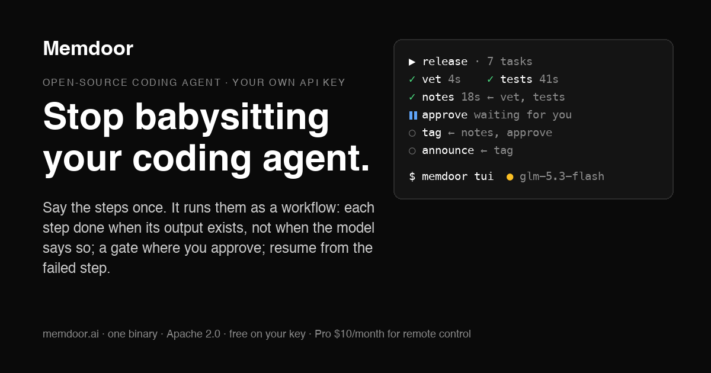

<div align="center">
  
  <h1>Memdoor</h1>
  <p><strong>Stop babysitting your coding agent. Say the steps once; each one is done when its output exists, not when the model says so.</strong></p>
  <p>
    <a href="LICENSE"></a>
    <a href="https://github.com/guregodevo/memdoor/actions/workflows/ci.yml"></a>
    
    
  </p>
</div>

```bash
curl -fsSL https://memdoor.ai/install.sh | bash
export OPEN_ROUTER_API_KEY=sk-or-...   # or ANTHROPIC_API_KEY, OPENAI_API_KEY, GEMINI_API_KEY, …
cd your-project && memdoor tui         # the first run sets the machine up
```

On a ChatGPT Plus or Pro plan? Skip the key: `memdoor connect chatgpt` (or
`/connect chatgpt` in the window) opens Sign in with ChatGPT, and your plan's
allowance answers Memdoor's turns. A Claude subscription cannot be used this
way (Anthropic's terms); Claude needs an API key.

No money on a key yet? A free OpenRouter account and `/model
nvidia/nemotron-3-super-120b-a12b:free` run a real session: 50 requests a day,
and the free hosts train on what they are sent, so a trial, not private code.

<p align="center"></p>

Describe the steps and the coder writes them as a workflow, one YAML per step,
run as a graph. A step is done when its file exists or its command exits 0,
never because the model says so. Independent steps run in parallel, a gate
waits for your approval, a failed run resumes at the failed step. Free, on
your own API key. Memdoor ships itself with
[its own workflow](https://memdoor.ai/workflows).

---

`memdoor tui` reads your files, writes patches, runs the build and fixes what
it broke, in the directory you launch it from. Every model call goes from your
machine to the provider you connected, on your account, at their list price.

Two things set it apart.

**A decision model in front of the chat model.** Jev (TypeSafe) answers a
typed question such as *is this hit relevant to the task?* with a calibrated
probability in under half a second, and the harness acts on it: search, file
and log reads return only what counts; only the tools the turn needs are sent;
a turn that stops making progress ends instead of looping to a cap. Measured
over 20 paired runs: 49% fewer input tokens on a question about the codebase,
26% fewer on an edit with a test, every answer right
([`docs/features/DECIDE.md`](docs/features/DECIDE.md)).

**Workflows.** Say the steps and the coder writes them as task files, one YAML
per step, run as a graph by [`mario`](https://github.com/guregodevo/mario).
Independent steps run in parallel; a step is done when its file exists or its
command exits 0; a gate waits for your approval; a failed run resumes at the
failed step. The files live in your repo, so a workflow is kept, shared and
run again, by hand or on your local cron
([`docs/features/WORKFLOWS.md`](docs/features/WORKFLOWS.md)). Why workflows
rather than skills: [the write-up](https://guregodevo.github.io/2026/10/06/workflows-not-skills/).
Worked examples, each run before it was added: [`examples/workflows/`](examples/workflows/).

A recorded session of the review loop (findings verified by running, a gate,
the fixes applied) plays at [memdoor.ai/workflows](https://memdoor.ai/workflows).

## Install

```bash
curl -fsSL https://memdoor.ai/install.sh | bash
export OPEN_ROUTER_API_KEY=sk-or-...   # or ANTHROPIC_API_KEY, OPENAI_API_KEY, GEMINI_API_KEY, … or /connect inside
cd your-project && memdoor tui         # the first run sets the machine up
```

macOS (Apple Silicon), Linux (amd64, arm64; static), Windows
(`irm https://memdoor.ai/install.ps1 | iex`). One binary, installed to
`~/.local/bin`, no sudo, no Docker, no Python. The installer
([`scripts/install.sh`](scripts/install.sh)) verifies the SHA-256 of what it
downloads.

## In the window

| Command | What it does |
|---|---|
| `/model` | Which model answers: the agent's ladder (cheapest rung first), or pin any model of your providers, with list prices |
| `/connect` | Add a provider: OpenRouter, Anthropic, OpenAI, Gemini, DeepSeek, Baseten, Groq, xAI, any OpenAI-compatible endpoint, your company's AI gateway; `/connect chatgpt` signs in with a ChatGPT Plus/Pro plan, no key |
| `/workflow` | The project's workflows and runs; enter opens a run's graph, `a` approves a gate, `/workflow:<name>` runs one |
| `/usage` | This month on your key, per model, and what the decision model kept out of the bill |
| `/remote` | This conversation on your phone: a link and a QR code, the terminal itself, end-to-end encrypted (Pro) |
| `/share` | A read-only link to the conversation, encrypted, secrets removed; `/unshare` deletes it |
| `/mcp` | Connect MCP servers from a URL, a command or a `.mcp.json` snippet |
| `/help` | The rest |

`Esc` interrupts a turn, `ctrl+o` expands tool frames, `Shift+Tab` sets the
reasoning effort, `@path` mentions a file. `MEMDOOR_APPROVE=changes` asks
before every command and write, for machines whose policy requires it.

## Where your data goes

Files, sessions and commands stay on your machine. What leaves is what the
model reads, sent to the provider you connected; on OpenRouter every request
carries `data_collection: deny` and hosts that train on paid inputs are kept out
of the ladders. The one exception is a model you pin whose id ends in `:free`:
its hosts train on what they are sent, the request says so (`allow`), and the
pin warns; use one for a trial, not on private code. On a vendor key or a company gateway nothing else is contacted:
[`docs/SECURITY.md`](docs/SECURITY.md) lists every host the binary can name and
a test fails the build on a new one.

## Price

- **Free**: the agent, the decision model and workflows (with local schedules), on your own key.
- **Pro, $10/month**: remote control through the memdoor.ai relay, and every workflow run's state kept on memdoor.ai so a workflow can wait on what another produced, from any machine. The seat never buys inference.
- **Enterprise**: the same served for a company, invoiced — hello@memdoor.ai.

## Documentation

- [Getting started](GETTING_STARTED.md)
- [Workflows](docs/features/WORKFLOWS.md) · [Scheduled checks](docs/features/cron-jobs.md) · [MCP servers](docs/features/MCP.md)
- [Providers](docs/features/PROVIDERS.md) · [Security](docs/SECURITY.md) · [Decisions](docs/features/DECIDE.md)
- [CLI reference](docs/reference/CLI.md) · [Architecture](docs/reference/ARCHITECTURE.md) · [Skills](docs/reference/SKILLS.md) · [ADRs](docs/adr/)
- The served docs: [memdoor.ai/docs](https://memdoor.ai/docs/getting-started)

## Repository layout

```
cmd/cli/       the CLI (cobra): tui, model, workflow, cron, account, …
gateway/       the local gateway: agent runtime, tools, providers, workflows, billing service
pkg/           the domain: decision, metering, plan, workflow (the mario task factory), …
web/           the memdoor.ai site and the served docs (React, Vite)
scripts/       install.sh, install.ps1, deploy.sh
docs/          features, reference, ADRs
examples/      workflows built by the coder and run, to copy into a project
```

## License

Apache License 2.0 — [LICENSE](LICENSE), [NOTICE](NOTICE). The public
repository is [github.com/guregodevo/memdoor](https://github.com/guregodevo/memdoor); issues there.
